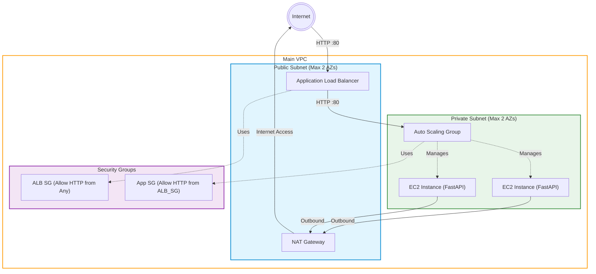

# AWS EC2 Public/Private Subnet & ALB Application

## プロジェクト概要

本プロジェクトは、AWS上にパブリックおよびプライベートサブネットを持つVPCを構築し、EC2インスタンス群をApplication Load Balancer (ALB) および Auto Scaling Group (ASG) 配下に配置するアーキテクチャをAWS CDK（TypeScipt）を用いて構築するためのコードベースです。
EC2インスタンス上では、User Dataおよびcfn-initを活用してFastAPIアプリケーションが自動的にデプロイ・起動される構成となっています。また、コスト最適化のためにNAT Gatewayを1つに削減しています。

## アーキテクチャ図

以下の図は、AWS上に展開されるVPC、サブネット、EC2インスタンス、ALBなどのリソースの関係性を示しています。



## 前提条件

このプロジェクトを実行・デプロイするために、事前に以下のツールがインストール・設定されている必要があります。

* **Node.js** (推奨バージョン: v18以上)
* **AWS CLI** (デプロイ先のAWSアカウントの認証情報のセットアップに必要)
* **AWS CDK CLI** (`npm install -g aws-cdk` または `npx cdk` で実行可能)
* デプロイ先のAWS環境のクレデンシャルが設定されていること（例: `~/.aws/credentials`）

## デプロイ手順

インフラストラクチャの開発とAWS環境へのデプロイは、以下のコマンド手順で行います。
コマンドはプロジェクトのCDKディレクトリ（例: `./cdk-infra`）に移動して実行してください。

### 1. 依存関係のインストール

プロジェクトに必要なnpmパッケージをインストールします。

```bash
cd cdk-infra
npm install
```

### 2. 環境のブートストラップ (初回のみ)

対象のAWSアカウントおよびリージョンでCDKを初めて使用する場合は、以下のコマンドを実行します。

```bash
npx cdk bootstrap
```

### 3. CloudFormationテンプレートの合成 (Synth)

CDKコードからAWS CloudFormationテンプレートを生成（合成）して確認します。

```bash
npx cdk synth
```

### 4. デプロイ実行

AWS環境へ実際にリソースをデプロイします。デプロイ時にはIAMの変更等に関するプロンプトが表示される場合があります。

```bash
npx cdk deploy
```

*(必要に応じて、プロファイル指定を行う場合は `--profile <YOUR_PROFILE>` オプションを付与してください)*

## テスト実行方法

CDK構築コードに対するJestを用いた単体テストは以下のコマンドで実行できます。

```bash
cd cdk-infra
npm test
```

テストを実行することで、生成されるCloudFormationテンプレートにおけるVPC設定やALB、EC2リソースの定義が期待通りにプロビジョニングされるか検証が行われます。
